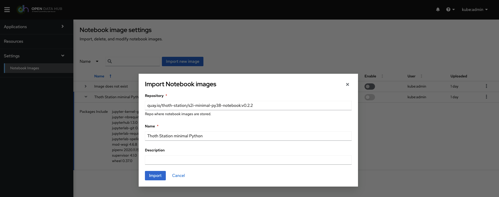
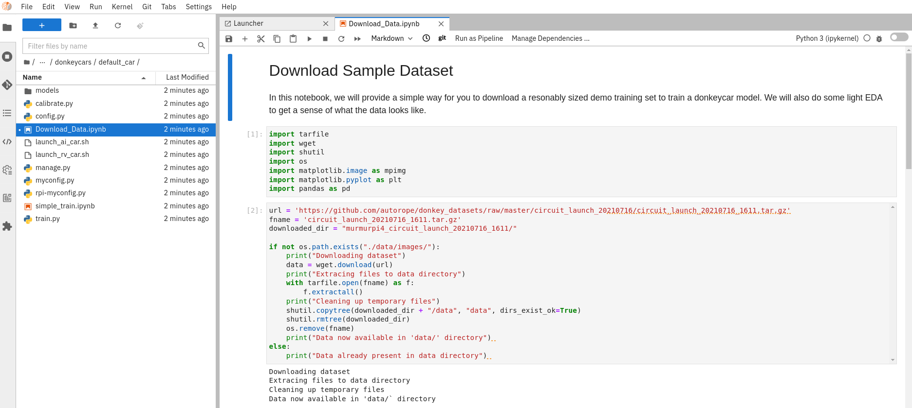

# Operate First in Action! 

Click on the picture below! and watch our video from Red Hat Summit 2022 to see Operate First in Action!

https://youtu.be/sfjAr5EI2ww

## What is Operate First? 

Open source has become the defining way of developing software. But how do we apply the principles of Open Source to operations and data? Operate First is a concept to incorporate operational experience into software projects.

Users, developers and operators collaborate on long running projects, services and tooling to explore the future of Open Source in the age of scale. They do so in a community supported open cloud environment, the **Operate First Community Cloud**

Go to the [Operate First](https://www.operate-first.cloud/) website to learn about this community in detail and how you can get involved!

# Some Operate First Projects in Action!

Follow the journey of a data scientist, who wants to share their experiments in a cloud environment. Using the services provided by the Operate First Community Cloud, they built a solution - not in isolation - but with re-usability in mind and early user exposure.  That solution evolved into a  feature, which contributed to [OpenDataHub.io](http://opendatahub.io), and was finally used as a key component for a complex and cross-product demonstration, to be revealed during a session at Red Hat Summit.

Now you can relive that story. Follow along below - or skip right to the [action](#action)

## Project Meteor

Project Meteor automates creation of interactive environments alongside publication-quality static content for data-science oriented repositories.

It works as an integrated, single tool allowing users to explore and test drive services, tools, and emerging technologies for developing intelligent applications.

It leverages knowledge obtained by members of Red Hat's Artificial Intelligence Center of Excellence (AICoE) when developing and presenting their analysis on various topic. This knowledge is encoded into Tekton pipelines which are ready to be used in a public environment of Operate First Cloud. It allows users to bring their analysis stored in git repository into a [Open Data Hub](https://opendatahub.io/) environment, ready to be worked on as well as presented to their peers and stakeholders as a JupyterBook website deployment.

Learn more at https://github.com/AICoE/meteor#project-meteor or give it a try right now https://shower.meteor.zone/

Project meteor is packaged as an [Operator Framework](https://operatorframework.io/) operator, ready to be deployed to any OLM compatible cluster.

## Bring Your Own Notebook (BYON)

The Bring Your Own Notebook service introduces a functionality that allows admins and users to bring their own notebook images and easily spin up reproducible notebook environments that can be shared with others.

By using the URL to your notebook image, you can easily spawn up a Jupyterhub environment suitable to run that notebook which allows others to reproduce your experiments with a click of a button.

Through a [working group](https://github.com/open-services-group/byon#bring-your-own-notebook-byon-working-group) which implements the BYON feature on the open [Operate First cloud](https://www.operate-first.cloud/), the goal is to introduce this to the [Open Data Hub](https://opendatahub.io/) project and ultimately introduce this as a feature into [Red Hat OpenShift Data Science](https://www.redhat.com/en/technologies/cloud-computing/openshift/openshift-data-science).

You can bring your notebook and give it a try right now at https://odh-dashboard-opf-jupyterhub-stage.apps.odh-cl1.apps.os-climate.org/.

## ML @ the Edge

Check out the Emerging technologies integration demo for ML at the edge [here!](https://github.com/AICoE/integration-demo-summit-2022)  

In this demo we walk through how to manage a machine learning application's lifecycle on an edge device using a couple of projects developed by Red Hat's Emerging Technologies group. Specifically, Open Data Hub, Microshift and Meteor running on the Operate First Community cloud.

The goal of this project is to demonstrate the development, training and deployment of a real intelligent edge device, an autonomous RV car, via the [Operate First community cloud](https://www.operate-first.cloud/).
 
 

 # What Now?

 ## Action

 Want to try this out for yourself?

* Go to https://shower.meteor.zone/ and paste `https://github.com/AICoE/integration-demo-summit-2022` into the meteor field.

* Once the notebook image is built, you will be able to select the `Open as JupyterHub` option to access the [Operate First JupyterHub Spawner](https://jupyterhub-opf-jupyterhub.apps.smaug.na.operate-first.cloud/) page and select the notebook image associated with your meteor.  

* After the notebook environment loads, you are ready to start experimenting! 

 ## Join the Community!
 ### Why should I join?
 Get free online processing power.
 Become an experienced contributor.
 Learn & Use GitOps.
 Work with OpenShift.
 Grow your Resume.
 
 ### What Do I need?
 Bring your Interest!
 Bring your Problems to solve!
 Bring your Own Notebook ;-)
 
 ### How can I join?
 * [Check out the GitHub repo](https://github.com/operate-first)
 * [Discuss on Slack](https://join.slack.com/t/operatefirst/shared_invite/zt-o2gn4wn8-O39g7sthTAuPCvaCNRnLww)
 * [Visit our Website](https://www.operate-first.cloud/)
 * [Sign up for the mailing list](https://lists.operate-first.cloud/admin/lists/community.lists.operate-first.cloud/)
 * [Join our meetup every other Tuesday @ 11:00 ET](https://meet.google.com/eyb-yegj-gji) on google meet.
 * [Watch previous sessions on Youtube!](https://www.youtube.com/channel/UCe87bwqlGoBQs2RvMQZ5_sg)
