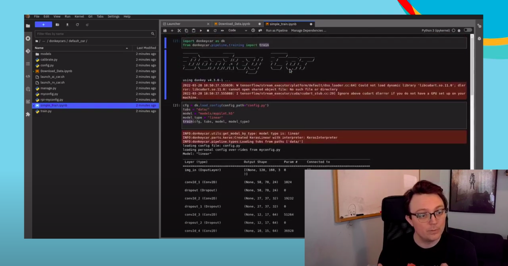
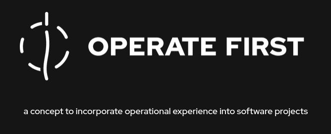
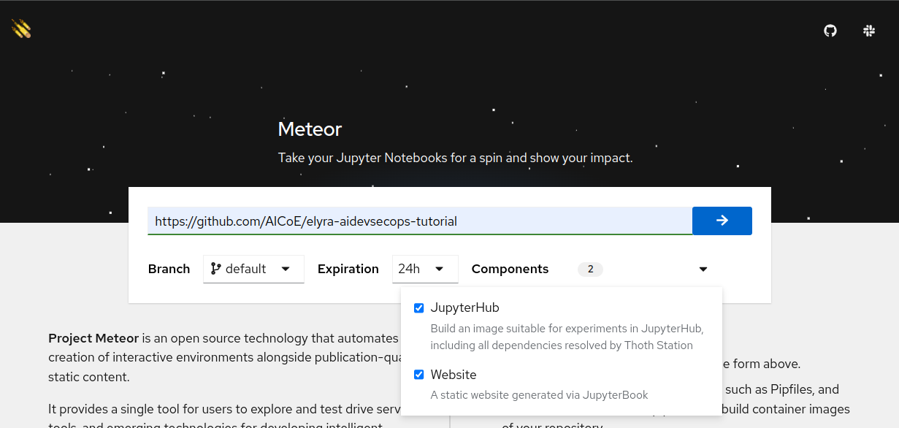
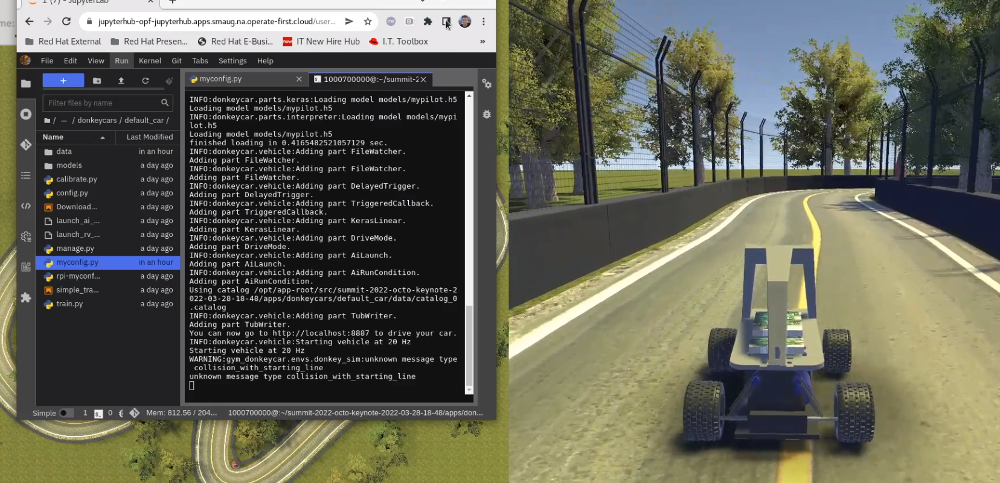

# Operate First in Action! 

Click on the pic below! and watch our video from Red Hat Summit 2022 and see Operate First in Action! _Note: this is WIP and image links to different video._

https://youtu.be/v4mur-_ywBM (_This is a place holder until video release_)

## What is Operate First? 

While open source has made software widely available, it has also exposed another barrier to entry: the ability to operate software in production. Proprietary services for operations undermine the open source model, so we must now shift our focus to open sourcing operations.

In doing so, developers and operators collaborate to apply a project’s operational considerations right back into the code. The result?

**Better code, better performance, better final product.**

Go to the [Operate First](https://www.operate-first.cloud/) project page to learn about this initiative in detail and how you can get involved with the Operate First community! 

# Some Operate First Projects in  Action!

## Project Meteor

Project Meteor automates creation of interactive environments alongside publication-quality static content for data-science oriented repositories.

It works as an integrated, single tool allowing users to explore and test drive services, tools, and emerging technologies for developing intelligent applications.

It leverages knowledge obtained by members of the Red Hat's Artificial Intelligence Center of Excellence (AICoE) when developing and presenting their analysis on various topic. This knowledge is encoded into Tekton pipelines which are ready to be used in a public environment of Operate First Cloud. It allows users to bring their analysis stored in git repository into a [Open Data Hub](https://opendatahub.io/) environment, ready to be worked on as well as presented to their peers and stakeholders as a JupyterBook website deployment.

Learn more at https://github.com/AICoE/meteor#project-meteor or give it a try right now https://shower.meteor.zone/

Project meteor is packaged as an [Operator Framework](https://operatorframework.io/) operator, ready to be deployed to any OLM compatible cluster.

## Bring Your Own Notebook (BYON)

The Bring Your Own Notebook service introduces a functionality that allows admins and users bring their own notebook images and easily spin up reproducible notebook environments that can be shared with others.

By using the URL to your notebook image, you can easily spawn up a Jupyterhub environment suitable to run that notebook which allows others to reproduce your experiments with a click of a button.

Through a [working group](https://github.com/open-services-group/byon#bring-your-own-notebook-byon-working-group) which implements the BYON feature on the open [Operate First cloud](https://www.operate-first.cloud/), the goal is to introduce this to the [Open Data Hub](https://opendatahub.io/) project and ultimately introduce this as a feature into [Red Hat OpenShift Data Science](https://www.redhat.com/en/technologies/cloud-computing/openshift/openshift-data-science).

## AI at the Edge Demo

Check out the full demo [HERE!](https://github.com/AICoE/summit-2022-octo-keynote#summit-2021-octo-keynote)  

In this demo we will walk you through how to manage a machine learning application lifecycle on an edge device using a couple of projects developed by Red Hat's Emerging Technologies group. Specifically, Open Data Hub, Microshift and Meteor running on the Operate First Community cloud.

The goal of this project is to demonstrate the development, training and deployment of a real intelligent edge device, an autonomous RV car, via the [Operate First community cloud](https://www.operate-first.cloud/).
 
 

 # What Now?

 ## Join the Community!
 ### Why should I join?
 Get free online processing power.
 Become an experienced contributor.
 Learn & Use GitOps.
 Work with OpenShift.
 Grow your Resume.
 
 ### What Do I need?
 Bring your Interest!
 Bring your Problems to solve!
 Bring your Own Notebook ;-)
 
 ### How can I join?
 * [Check out the GitHub repo](https://github.com/operate-first)
 * [Discuss on Slack](https://join.slack.com/t/operatefirst/shared_invite/zt-o2gn4wn8-O39g7sthTAuPCvaCNRnLww)
 * [Visit our Website](https://www.operate-first.cloud/)
 * [Sign up for the mailing list](https://lists.operate-first.cloud/admin/lists/community.lists.operate-first.cloud/)
 * [Join our meetup every other Tuesday @ 11:00 ET](https://meet.google.com/eyb-yegj-gji) on google meet.
 * [Watch previous sessions on Youtube!](https://www.youtube.com/channel/UCe87bwqlGoBQs2RvMQZ5_sg)
